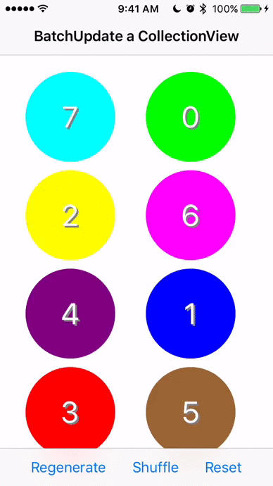

# BatchUpdateACollectionView
Sample code for animating batch changes to UICollectionView

## Preview

## Examples included

- **Shuffle:** Randomly rearranges the numbers that are currently being displayed
- **Regenerate:** Picks 8 random numbers between 0-15 and animates this. This simulates the three possibilities (deletion, rearrangement, insertion)
- **Reset:** Displays the first 8 numbers.
